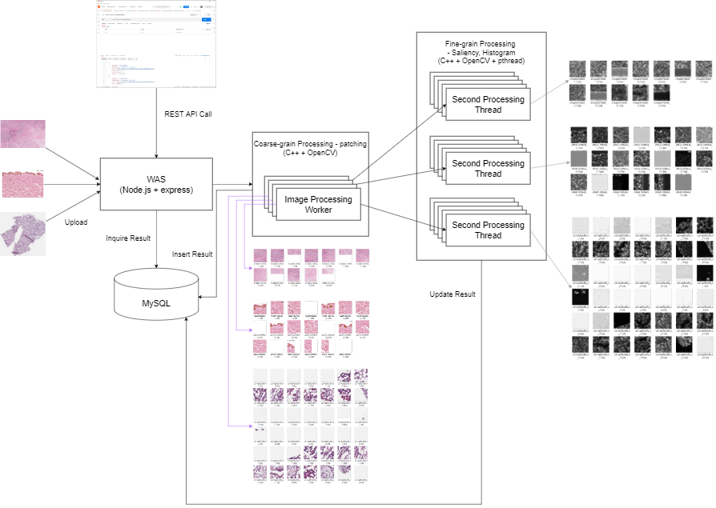
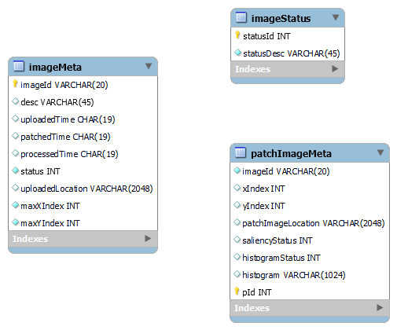
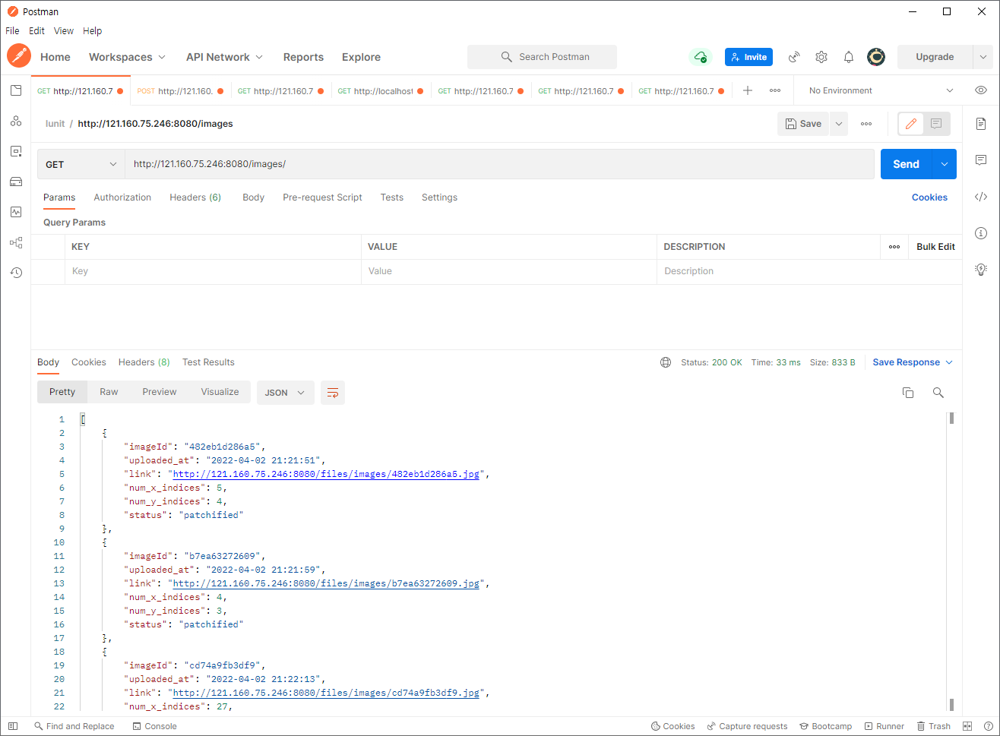
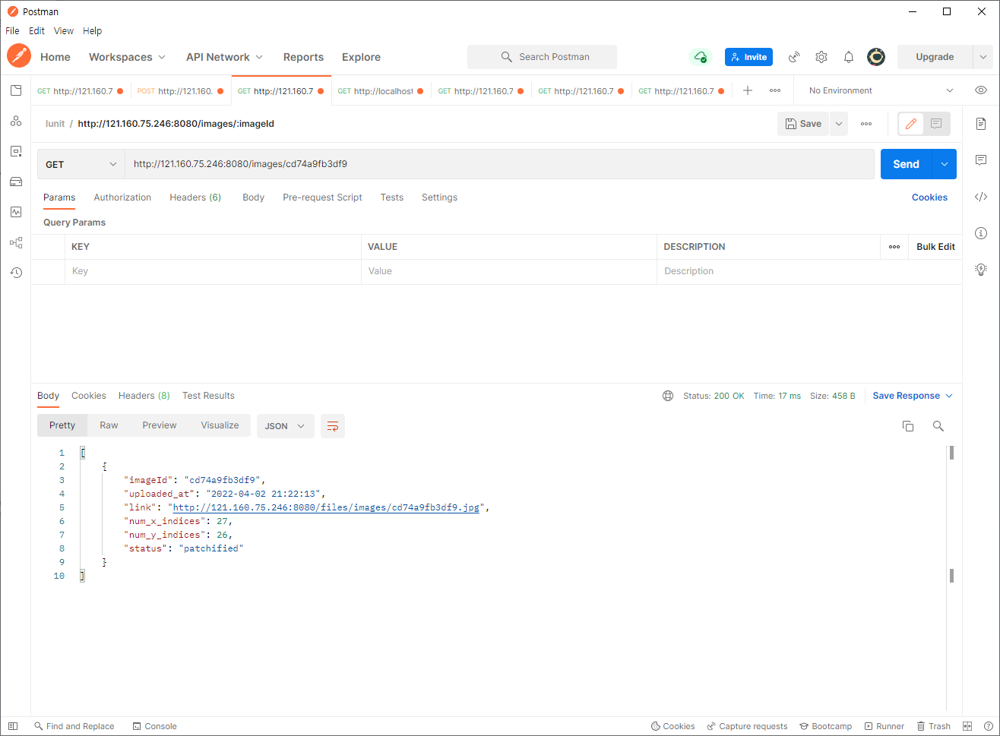
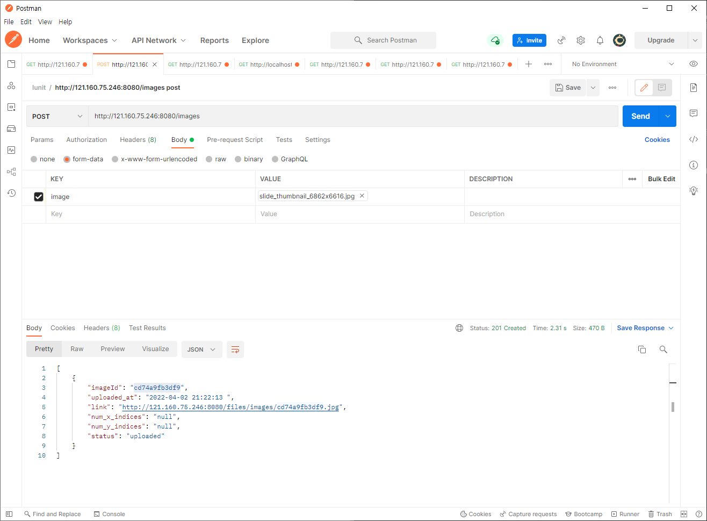
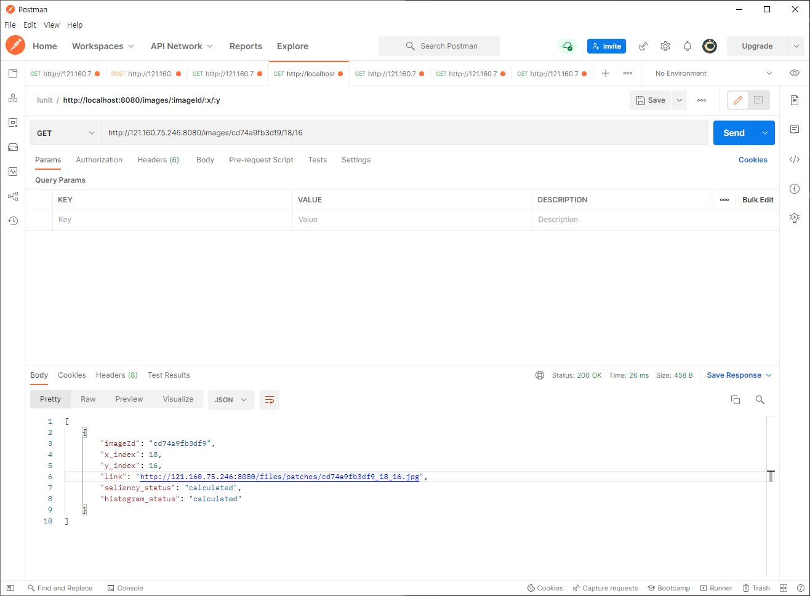
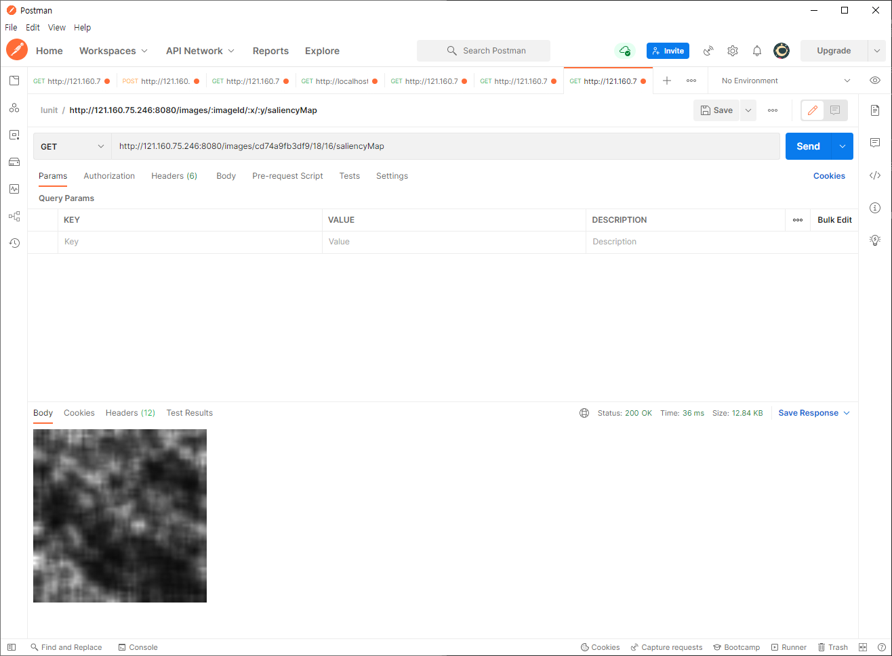
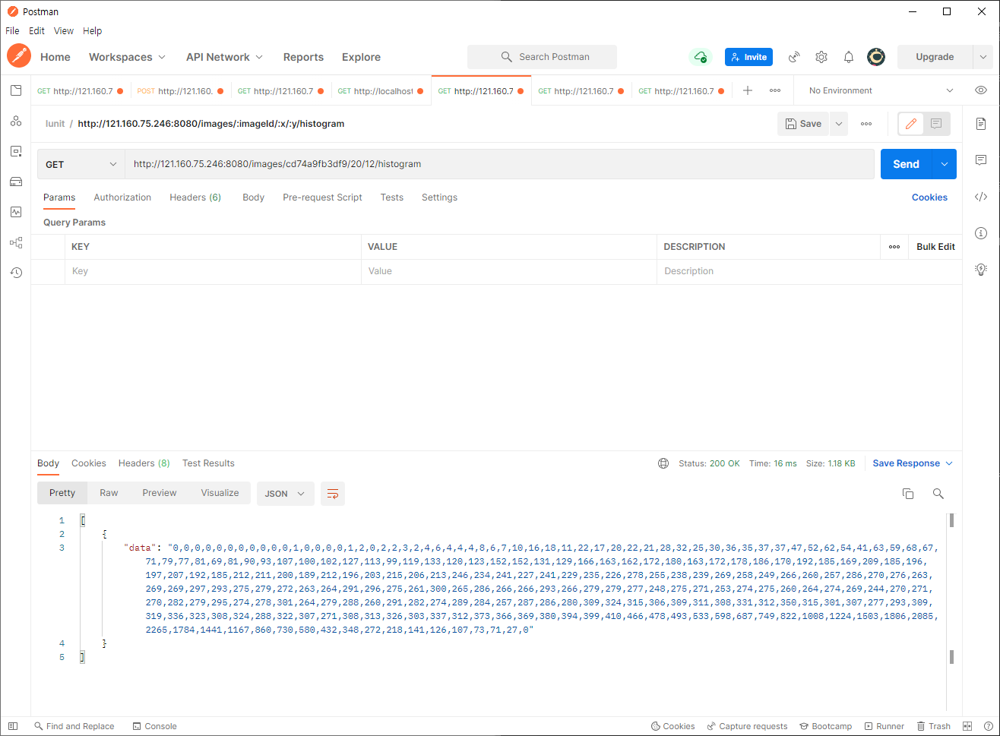
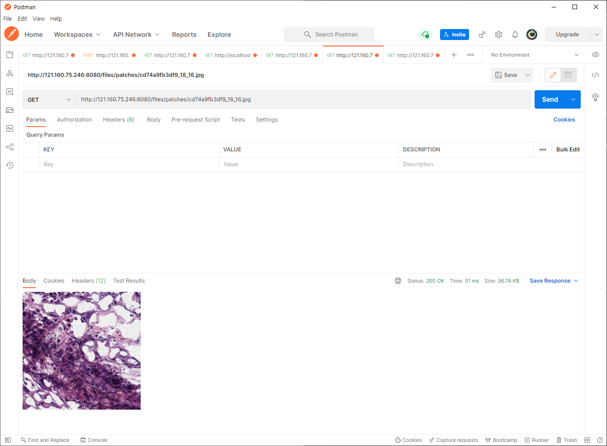

# Overall Structure

## 구성
- WAS(Container) : RESTful API를 처리 하는 Backend - Node.js와 express로 구성했으며, 필요한 다양한 npm package가 설치되어 있음
- MySQL(Native) : Image 처리 현황, Image 메타들이 저장되어 있는 Database 시스템
- Processing Worker(Native) : WAS를 통해서 업로드된 이미지 파일을 Patch(256*256)로 나누고 각각의 Patch를 이미지 프로세싱 하는 Multithread로 처리 
- Upload된 파일은 하나의 디렉토리에 저장, 프로세싱된 파일은 Image ID별 Directory 사용

## Source Code
- WAS : app.js (Node.js에서 동작하는 소스 코드)
- Image Processing : image_processing_worker.cpp (Coarse/Fine grain 코드)

## ERD

- 데이터 저장용 Simple Table 운영
- 이미지 메타 저장을 위한 Table은 시퀀스 ID Hash로 Partioning (1,000) 진행

## 환경 구성

[환경 구성 Command](environment_configuration.md)

# Workflow
## Upload
1. RESTful API를 통한 Image upload, Unique id 발급, 하부 directory 내 저장, DB 업데이트
2. Image processing processor 생성 및 인자 전달, Upload 마다 별도의 Process 생성 (Multi process), Processor 생성은 Async로 WAS는 처리 결과를 가디리지 않고 새로운 요청 처리
3. Processor에서 pathcfying(Single Process), Saliency map 생성/History(Multi Thread)로 처리함, 결과는 하부 directory 및 DB로 업데이트

## Inquery
1. RESTful API를 통한 이미지 리스트, 이미지 정보, Patch 파일 별 프로세싱 정보 확인
2. 진행 결과에 대한 DB 내용 전달

## File Download
1. files/images, files/patches, :imageId/:x/:y/saliencymap 으로 다운로드
2. WAS에서 실제 저장 위치에서 파일을 읽어 다운로드 - 내부 구조 노출 없음

# 미진 사항
- 소스 코드내 MySQL ID/PW/TABLE 정보 분리 - Container 내부에서만 사용가능하고 SSH 계정과 분리 되어 있어 우선 진행하지 않음
- Patch meta Update시 UPSERT 쿼리 사용 필요
- Node.js 서버 앞쪽에 Dispatcher 추가로 RESTful 

# Remark
- 소스 코드내 주석은 별도로 달지 않고, 함수이름/변수이름 및 흐름으로 이해하도록 작성
- 이미지 파일 포맷은 png와 jpg 처리
- Saliency Map과 History는 예제 파일 옵션을 그대로 사용함

# API Result

- GET /images, GET /images/{imageId}

- POST /images

- GET /images/{imageId}/{x}/{y}

- GET /images/{imageId}/{x}/{y}/saliencyMap

- GET /images/{imageId}/{x}/{y}/histogram

- Patch file download

